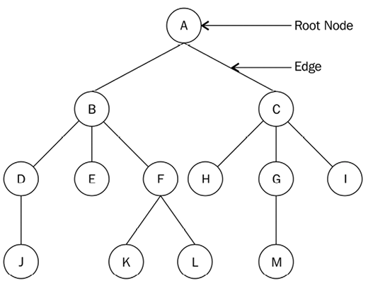

# Trees

A Tree is a non-linear data structure, as there is a parent-child relationship between the items. Data is organized in a hierarchical form. The topmost node is called the root of the tree. The elements that are directly under an element are called its children. The element directly above something is called its parent. The elements with no children are called leaves.

All of the data items in linear data structures, such as arrays, lists, stacks, and queues, can be traversed in one pass, whereas this is not possible in the case of non-linear data structures such as trees;

## Binary Tree

A binary tree is a tree in which each node has at most two children (can have one or none), which are referred to as the left child and the right child.
A tree is called a `full binary tree` if all the nodes of a binary tree have either zero or two children, and if there is no node that has one child.
A `perfect binary tree` has all the nodes in the binary tree filled, and it doesn’t have space vacant for any new nodes. New nodes can only be added by increasing the tree's height.

A binary tree can be `balanced` or `unbalanced`. In a balanced binary tree, the difference in height of the left and right subtrees for every node in the tree is no more than 1

Balanced Binary Tree:

Unbalanced Binary Tree:

