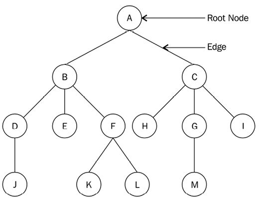
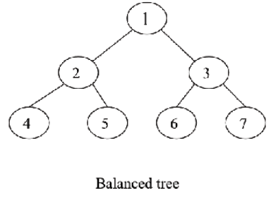
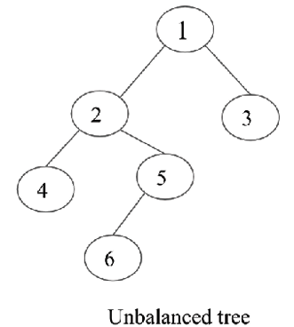
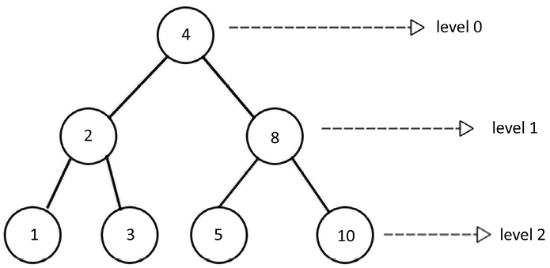
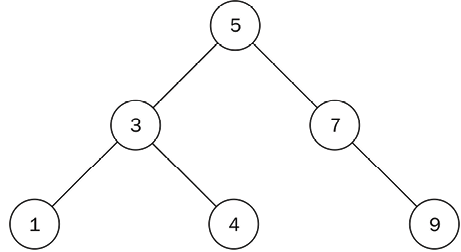

# Trees

A Tree is a non-linear data structure, as there is a parent-child relationship between the items. Data is organized in a hierarchical form. The topmost node is called the root of the tree. The elements that are directly under an element are called its children. The element directly above something is called its parent. The elements with no children are called leaves.



All of the data items in linear data structures, such as arrays, lists, stacks, and queues, can be traversed in one pass, whereas this is not possible in the case of non-linear data structures such as trees;

## Binary Tree

A binary tree is a tree in which each node has at most two children (can have one or none), which are referred to as the left child and the right child.
A tree is called a `full binary tree` if all the nodes of a binary tree have either zero or two children, and if there is no node that has one child.
A `perfect binary tree` has all the nodes in the binary tree filled, and it doesn’t have space vacant for any new nodes. New nodes can only be added by increasing the tree's height.

A binary tree can be `balanced` or `unbalanced`. In a balanced binary tree, the difference in height of the left and right subtrees for every node in the tree is no more than 1

Balanced Binary Tree:


Unbalanced Binary Tree:


To create a node in a binary tree, we need to define a class for the node. The class will have three attributes: the data, the left child, and the right child. The left and right child will be initialized as None, as they will be empty initially.

```python
class Node:
    def __init__(self, data):
        self.data = data
        self.left = None
        self.right = None
```

## Tree Traversal

There are three ways to traverse a tree:

- Inorder Traversal
- Preorder Traversal
- Postorder Traversal

### Inorder Traversal

In this traversal, the left subtree is visited first, then the root, and finally the right subtree. The left subtree is visited recursively, and then the right subtree is visited recursively.

```python
def inorder_traversal(node):
    if node.get_left_node() is not None:
        inorder_traversal(node.get_left_node())

    print(node.get_data(), end=' ')

    if node.get_right_node() is not None:
        inorder_traversal(node.get_right_node())
```

### Preorder Traversal

In this traversal, the root is visited first, then the left subtree, and finally the right subtree. The root is visited recursively, and then the left subtree is visited recursively.

```python
def preorder_traversal(node):
    print(node.get_data(), end=' ')

    if node.get_left_node() is not None:
        preorder_traversal(node.get_left_node())

    if node.get_right_node() is not None:
        preorder_traversal(node.get_right_node())
```

### Postorder Traversal

In this traversal, the left subtree is visited first, then the right subtree, and finally the root. The left subtree is visited recursively, and then the right subtree is visited recursively.

```python
def postorder_traversal(node):
    if node.get_left_node() is not None:
        postorder_traversal(node.get_left_node())

    if node.get_right_node() is not None:
        postorder_traversal(node.get_right_node())

    print(node.get_data(), end=' ')
```

### Level Order Traversal

In this traversal, the nodes are visited level by level, starting from the root. The nodes at each level are visited from left to right. This traversal is also known as breadth-first search and it uses a queue to store the nodes at each level.



```python
from collections import deque

def level_order_traversal(root_node):
    list_of_nodes = []
    traversal_queue = deque([root_node])
    while len(traversal_queue) > 0:
        node = traversal_queue.popleft()
        list_of_nodes.append(node.data)
        if node.left_child:
            traversal_queue.append(node.left_child)
            if node.right_child:
                traversal_queue.append(node.right_child)
    return list_of_nodes
print(level_order_traversal(n1))
```

The following are some important applications of binary trees:

1. Binary trees as expression trees are used in compilers
2. It is also used in Huffman coding in data compression
3. Binary search trees are used for efficient searching, insertion, and deletion of a list of items
4. Priority Queue (PQ), which is used for finding and deleting minimum or maximum items in a collection of elements in logarithm time in the worst case

## Expression Trees

An expression tree is a binary tree in which each internal node corresponds to an operator, and each leaf node corresponds to an operand. The leaves of an expression tree are the operands, and the other nodes are the operators. The expression tree is used to represent expressions in a tree form. The expression tree can be used to evaluate the expression, and it can also be used to convert the infix expression to postfix and prefix expressions.

The **infix** expression is the expression in which the operator is between the operands, such as `a + b`. The **postfix** expression is the expression in which the operator is after the operands, such as `ab+`. The **prefix** (or polish) expression is the expression in which the operator is before the operands, such as `+ab`.

In-order traversal of the expression tree gives the infix expression, and the pre-order traversal of the expression tree gives the prefix expression. The post-order traversal of the expression tree gives the postfix expression.

## Binary Search Tree

A binary tree is called a binary search tree (BST) if the following conditions are satisfied:

- The left subtree of a node contains only nodes with keys less than (or equal to) the node's key.
- The right subtree of a node contains only nodes with keys greater than the node's key.
- The left and right subtree must also be a binary search tree.



```python
class Tree:
  def __init__(self):
    self.root_node = None
```

We can perform the following operations on a binary search tree:

- Insertion
- Deletion
- Searching
- Find min and max
- Traversal

### Insertion

We need to make sure not to violate the properties of the binary search tree while inserting a new node. First we need to compare the new node with the root node to decide if it goes to the left or right subtree. Then we need to compare the new node with the left or right child of the root node, and so on, until we find an empty place to insert the new node.

```python
class Node:
    def __init__(self, data):
        self.data = data
        self.right_child = None
        self.left_child = None
class Tree:
    def __init__(self):
        self.root_node = None
    def insert(self, data):
        node = Node(data)
        if self.root_node is None:
            self.root_node = node
            return self.root_node
        else:
            current = self.root_node
            parent = None
            while True:
                parent = current
                if node.data < parent.data:
                    current = current.left_child
                    if current is None:
                        parent.left_child = node
                        return self.root_node
                else:
                    current = current.right_child
                    if current is None:
                        parent.right_child = node
                        return self.root_node
    def inorder(self, root_node):
      current = root_node
      if current is None:
          return
      self.inorder(current.left_child)
      print(current.data)
      self.inorder(current.right_child)

```

### Searching

To search for a node in a binary search tree, we start from the root node and compare the data with the root node. If the data is less than the root node, we move to the left subtree; if the data is greater than the root node, we move to the right subtree. We continue this process until we find the node or reach the end of the tree.

```python
    def search(self, data):
        current = self.root_node
        while True:
            if current is None:
                print("Item not found")
                return None
            if current.data is data:
                print("Item found", data)
                return data
            if current.data > data:
                current = current.left_child
            else:
                current = current.right_child
```

### Deletion

There are three possible scenarios that we need to take care of during this process. The node that we want to remove might have the following:

- No children: If there is no leaf node, directly remove the node
- One child: In this case, we swap the value of that node with its child, and then delete the node
- Two children: In this case, we first find the in-order successor or predecessor, swap their values, and then delete that node

Because of the third case we need a helper method. We need to find the node with the smallest value in the right subtree of the node to be deleted. This node is called the in-order successor. We can also find the node with the largest value in the left subtree of the node to be deleted. This node is called the in-order predecessor.

```python
    def get_node_with_parent(self, data):
        parent = None
        current = self.root_node
        if current is None:
            return (parent, None)
        while True:
            if current.data == data:
                return (parent, current)
            elif current.data > data:
                parent = current
                current = current.left_child
            else:
                parent = current
                current = current.right_child
        return (parent, current)

    def remove(self, data):
        parent, node = self.get_node_with_parent(data)
        if parent is None and node is None:
            return False
        # Get children count
        children_count = 0
        if node.left_child and node.right_child:
            children_count = 2
        elif (node.left_child is None) and (node.right_child is None):
            children_count = 0
        else:
            children_count = 1

        if children_count == 0:
            if parent:
                if parent.right_child is node:
                    parent.right_child = None
                else:
                    parent.left_child = None
            else:
                self.root_node = None

        elif children_count == 1:
            next_node = None
            if node.left_child:
                next_node = node.left_child
            else:
                next_node = node.right_child
            if parent:
                if parent.left_child is node:
                    parent.left_child = next_node
                else:
                    parent.right_child = next_node
            else:
                self.root_node = next_node

        else:
            parent_of_leftmost_node = node
            leftmost_node = node.right_child
            while leftmost_node.left_child:
                parent_of_leftmost_node = leftmost_node
                leftmost_node = leftmost_node.left_child
            node.data = leftmost_node.data
```

### Find Min and Max

The structure of the binary search tree makes searching a node that has a maximum or a minimum value very easy. To find a node that has the smallest value in the tree, we start traversal from the root of the tree and visit the left node each time until we reach the end of the tree. Similarly, we traverse the right subtree recursively until we reach the end to find the node with the biggest value in the tree.
