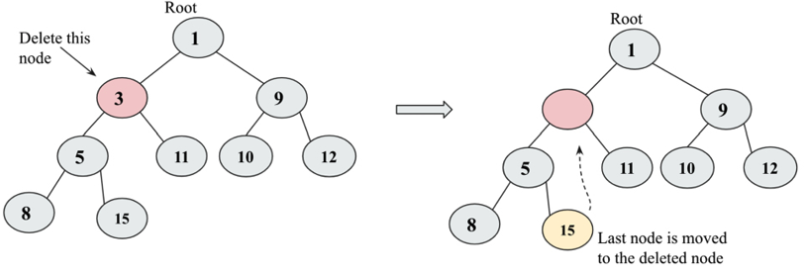

# Heaps and Priority Queues

## Heaps

A heap data structure is a specialization of a tree in which the nodes are ordered in a specific way. A Heap can be of two types:

- Max Heap
- Min Heap

In a **max heap**, each parent node value must always be greater than or equal to all its children. In this kind of tree, the root node must be the greatest value in the tree. In a **min heap**, the relationship between parent and children is that the value of the parent node must always be less than or equal to its children. This rule should be followed by all the nodes in the tree

If the binary heap is a complete binary tree with n nodes, then it will have a minimum height of log2n. In order to implement the heap, we can derive a relationship between parent and child nodes in index values. The relationship is that the children of any node at the n index can be retrieved easily, in other words, the left child will be located at 2n, and the right child will be located at 2n + 1. Index should start from 1, not 0.

### Implementing a Min Heap

```python
class MinHeap:
  def __init__(self):
    self.heap = [0]
    self.size = 0
```

In the above code, we have created a class named `MinHeap` and initialized the heap list with a single element 0. This is done to make the index start from 1. We have also initialized the size of the heap to 0.

#### Inserting an Element

We first append (insert it in the last position) the element to the heap list and increment the size of the heap. Then we call the `heapify` method to maintain the heap property. Heapifying is the process of maintaining the heap property by rearranging the elements in the heap.
We need a helper method to swap the elements in the heap list.

```python
class MinHeap:
  def __init__(self):
    self.heap = [0]
    self.size = 0

  def arrange(self, k):
    while k // 2 > 0: # while parent exists
      if self.heap[k] < self.heap[k // 2]:
        self.heap[k], self.heap[k // 2] = self.heap[k // 2], self.heap[k]
      k //= 2

  def insert(self, item):
    self.heap.append(item)
    self.size += 1
    self.arrange(self.size)

h = MinHeap()
  for i in (4, 8, 7, 2, 9, 10, 5, 1, 3, 6):
    h.insert(i)
```

### Deleting an element

One case is to delete the root node. In this case, we remove the root node and replace it with the last node in the heap. Then we call the `heapify` method to maintain the heap property.

Another case is to delete any other node. In this case, we first find the index of the element to be deleted. We then replace the element with the last element in the heap and call the `heapify` method to maintain the heap property.



## Priority Queues

A priority queue is a data structure that stores elements in a way that they can be retrieved based on their priority. The element with the highest priority is retrieved first. Priority queues are used in many applications, such as task scheduling, data compression, and graph algorithms.
If two data elements have the same priority, they are served according to their order in the queue.
In **Priority Queues**, the elements are stored in a way that the element with the highest priority is served first. The priority queue can be implemented using heaps.

```python
class Node:
  def __init__(self, info, priority):
    self.info = info
    self.priority = priority

class PriorityQueue:
  def __init__(self):
    self.queue = []
```

To insert we'll assume that the element with the highest priority has the lowest value. We'll insert the element in the queue list in a way that the element with the highest priority is at the beginning of the list.

```python
def show(self):
  for x in self.queue:
    print(f"{x.info} - {x.priority}")

def insert(self, node):
  if len(self.queue) == 0:
    self.queue.append(node)
  else:
    for i in range(len(self.queue)):
      if self.queue[i].priority >= node.priority:
        if i == len(self.queue) - 1:
          self.queue.insert(i + 1, node)
        else:
          continue
      else:
        self.queue.append(node)
        return True

def delete(self):
  x = self.queue.pop(0)
```

It's more common to implement a priority queue using a heap. The heap can be a max heap or a min heap. In a max heap, the element with the highest priority will be at the root node. In a min heap, the element with the highest priority will be at the leaf node.

```python
class PriorityQueueHeap:
    def __init__(self):
        self.heap = [()]
        self.size = 0

    def arrange(self, k):
        while k // 2 > 0:
            if self.heap[k][0] < self.heap[k//2][0]:
                self.heap[k], self.heap[k//2] = self.heap[k//2], self.heap[k]
            k //= 2

    def insert(self,priority, item):
        self.heap.append((priority, item))
        self.size += 1
        self.arrange(self.size)

    def sink(self, k):
        while k * 2 <= self.size:
            mc = self.minchild(k)
            if self.heap[k][0] > self.heap[mc][0]:
                self.heap[k], self.heap[mc] = self.heap[mc], self.heap[k]
            k = mc

    def minchild(self, k):
        if k * 2 + 1 > self.size:
            return k * 2
        elif self.heap[k*2][0] < self.heap[k*2+1][0]:
            return k * 2
        else:
            return k * 2 + 1

    def delete_at_root(self):
        item = self.heap[1][1]
        self.heap[1] = self.heap[self.size]
        self.size -= 1
        self.heap.pop()
        self.sink(1)
        return item
```
