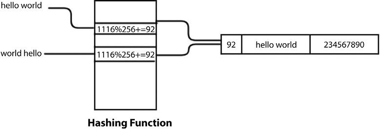

# Hash Tables

A hash table is a data structure that stores key-value pairs. It uses a hash function to compute an index into an array of buckets or slots, from which the desired value can be found.


Elements are accessed by keys. The hash function takes a key and returns an index in the hash table. The hash table will have an array of buckets, each with a unique index. The hash function will return the index of the bucket where the key-value pair should be stored. Hash tables stores the data in a very efficient way so that retrieval can be very fast. Hash tables are based on a concept called hashing

## Hashing functions

A hash function is a function that converts an input (or 'key') into an integer value. The hash function is used to map the key to a specific location in the hash table. The hash function should be deterministic, meaning that the same input will always produce the same output. The hash function should also be fast to compute. In practice, most hash functions are not perfect and can sometimes produce the same output for different inputs. This is called a 'collision'. There are different ways to handle collisions, such as chaining or open addressing.
If we try to develop a hash function that avoids collisions, this becomes very slow, and a slow hash function does not serve the purpose of the hash table. So, we use a fast hash function and try to find a strategy to resolve the collisions rather than trying to find a perfect hash function

Example:

```python
def myhash(s):
       mult = 1
       hv = 0
       for ch in s:
           hv += mult * ord(ch)
           mult += 1
       return hv
```

### Resolving Collisions



There are two main ways to resolve collisions in a hash table: chaining and open addressing.

### Open Addressing

Open Addressing is a technique of collision resolution. In open addressing, all elements are stored in the hash table itself. When a new element is to be inserted, the hash function is computed, and if the bucket is already occupied, the algorithm will try to find the next available slot in the hash table. There are different ways to find the next available slot, such as linear probing, quadratic probing, and double hashing.

**Linear Probing**: In linear probing, if the bucket is already occupied, the algorithm will try to find the next available slot by incrementing the index by 1 until an empty slot is found. The problem with linear probing is that it can cause clustering, causing the hash table to become inefficient by having so many elements in the same bucket.

- Implementing a Hash Table with Linear Probing

```python
class HashItem:
  def __init__(self, key, value):
    self.key = key
    self.value = value

class HashTable:
  def __init__(self):
    self.size = 256 # Set the size of the hash table to 256
    self.slots = [None for i in range(self.size)] # Create an array of size 256
    self.count = 0 # Set the initial count of elements to zero

    def _hash(self, key):
          mult = 1
          hv = 0
          for ch in key:
              hv += mult * ord(ch)
              mult += 1
          return hv % self.size
    def put(self, key, value):
        item = HashItem(key, value) # Create a new HashItem
        h = self._hash(key) # Get the hash of the key

        while self.slots[h] != None: # If the slot is not empty
            if self.slots[h].key == key: # If the key is already in the slot
                break
            h = (h + 1) % self.size # Move to the next slot
        if self.slots[h] == None: # If the slot is empty
            self.count += 1 # Increment the count
        self.slots[h] = item # Put the item in the slot
        self.check_growth() # Check if the hash table needs to grow
```

We may need to grow the hash table if the load factor exceeds a certain threshold. The load factor is the ratio of the number of elements to the size of the hash table. If the load factor exceeds a certain threshold, we need to grow the hash table to avoid clustering. **Load factor = number of elements / size of the hash table**. We need to define the max load factor threshold and the growth factor. The growth factor is the factor by which the hash table will grow when it needs to be resized.

```python
class HashTable:
  def __init__(self):
    self.size = 256
    self.slots = [None for i in range(self.size)]
    self.count = 0
    self.MAXLOADFACTOR = 0.75 # Set the max load factor to 0.75
    self.GROWTH_FACTOR = 2 # Set the growth factor to 2

  def check_growth(self):
    loadfactor = self.count / self.size
    if loadfactor > self.MAXLOADFACTOR:
        print("Load factor before growing the hash table", self.count / self.size )
        self.growth()
        print("Load factor after growing the hash table", self.count / self.size )

  def growth(self):
    New_Hash_Table = HashTable()
    New_Hash_Table.size = self.GROWTH_FACTOR * self.size
    New_Hash_Table.slots = [None for i in range(New_Hash_Table.size)]

    for i in range(self.size):
      if self.slots[i] != None:
        New_Hash_Table.put(self.slots[i].key, self.slots[i].value)

    self.size = New_Hash_Table.size
    self.slots = New_Hash_Table.slots
```

### Retrieving an Element

To retrieve an element from the hash table, we need to compute the hash of the key and then check if the key is in the slot. If the key is not in the slot, we need to move to the next slot until we find the key or an empty slot. If we use linear probing, we need to increment the index by 1 until we find the key or an empty slot.

```python
def get(self, key):
    h = self._hash(key)    # computed hash for the given key
    while self.slots[h] != None:
        if self.slots[h].key == key:
            return self.slots[h].value
        h = (h+ 1) % self.size
    return None
```

### Implementing a Hash Table as a Dictionary

```python
def __setitem__(self, key, value):
    self.put(key, value)
def __getitem__(self, key):
    return self.get(key)
```
