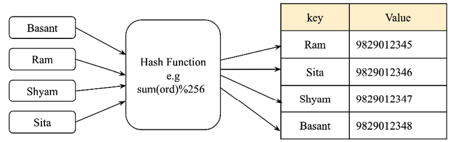

# Hash Tables

A hash table is a data structure that stores key-value pairs. It uses a hash function to compute an index into an array of buckets or slots, from which the desired value can be found.

Elements are accessed by keys. The hash function takes a key and returns an index in the hash table. The hash table will have an array of buckets, each with a unique index. The hash function will return the index of the bucket where the key-value pair should be stored. Hash tables stores the data in a very efficient way so that retrieval can be very fast. Hash tables are based on a concept called hashing
