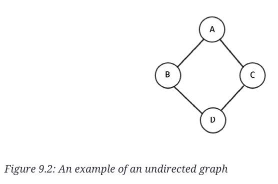
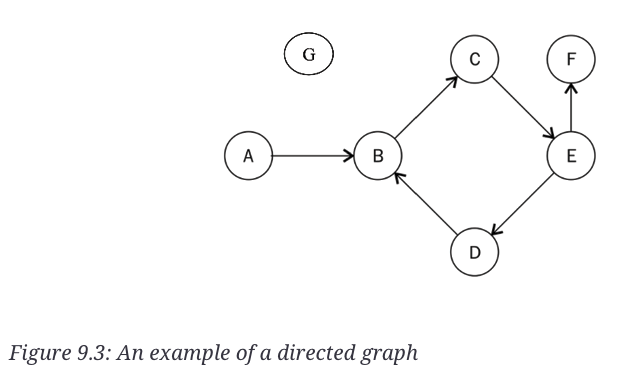
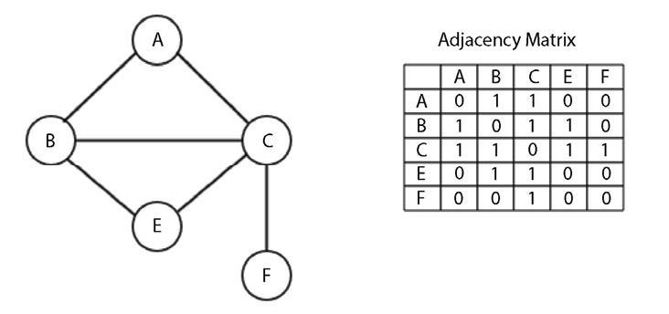

# Graphs and Algorithms

A graph is a data structure that consists of a finite set of vertices (nodes) and a set of edges connecting these vertices. A graph can be directed or undirected, and it can be weighted or unweighted. Graphs are used to model many real-world systems, such as computer networks, social networks, transportation networks, and more.

Math Expresion: `G = (V, E)`. It's a formal mathematical representation of a graph, where `V` is the set of vertices and `E` is the set of edges.





## Graph Representation

Graphs can be represented using different data structures. The two most common ways to represent a graph are the adjacency matrix and the adjacency list. The representation you choose depends on the type of graph you are working with and the operations you need to perform on it. If the graph has so many edges and few vertices, then the adjacency matrix is a good choice. If the graph has so many vertices and few edges, then the adjacency list is a good choice.

### Adjacency List

In this representation all the nodes directly connected to a node X are stored in a list. The adjacency list is an array of linked lists, where each element in the array represents a vertex and the linked list represents the vertices that are adjacent to that vertex. The number of linked lists in the array is equal to the number of vertices in the graph.
We can also use a Python dictionary to represent an adjacency list. The keys of the dictionary are the vertices, and the values are the lists of adjacent vertices.
This type of representation is more efficient when the graph is sparse (i.e., it has fewer edges) and we may need to delete or add nodes in the graph.

```python
graph = dict()
graph['A'] = ['B', 'C']
graph['B'] = ['E','C', 'A']
graph['C'] = ['A', 'B', 'E','F']
graph['E'] = ['B', 'C']
graph['F'] = ['C']
```

### Adjacency Matrix

In an adjacency matrix, the rows and columns represent the vertices of the graph, and the values in the matrix represent the edges between the vertices. If the graph is undirected, the matrix is symmetric. If the graph is directed, the matrix is not symmetric. The adjacency matrix is a 2D array of size `V x V`, where `V` is the number of vertices in the graph. The value of the matrix at row `i` and column `j` is `1` if there is an edge between vertices `i` and `j`, and `0` otherwise.



An adjancency matrix can be implemented using the adjacency list representation. The adjacency list representation is more efficient when the graph is sparse, while the adjacency matrix representation is more efficient when the graph is dense.

```python
matrix_elements = sorted(graph.keys())
cols = rows = len(matrix_elements)

# Create a matrix filled with zeros
adjacency_matrix = [[0 for x in range(rows)] for y in range(cols)]
edges_list = []

# Create tuples of edges
for key in matrix_elements:
    for neighbor in graph[key]:
        edges_list.append((key, neighbor))

# Fill the matrix with the edges
for edge in edges_list:
    i = matrix_elements.index(edge[0])
    j = matrix_elements.index(edge[1])
    adjacency_matrix[i][j] = 1

print(adjacency_matrix)
```
