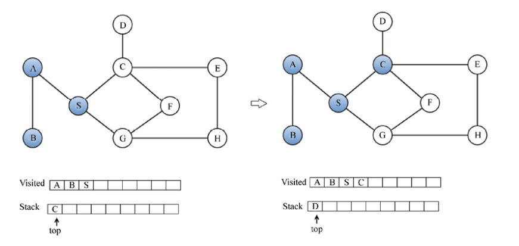

# Graphs and Algorithms

A graph is a data structure that consists of a finite set of vertices (nodes) and a set of edges connecting these vertices. A graph can be directed or undirected, and it can be weighted or unweighted. Graphs are used to model many real-world systems, such as computer networks, social networks, transportation networks, and more.

Math Expresion: `G = (V, E)`. It's a formal mathematical representation of a graph, where `V` is the set of vertices and `E` is the set of edges.


## Graph Representation

Graphs can be represented using different data structures. The two most common ways to represent a graph are the adjacency matrix and the adjacency list. The representation you choose depends on the type of graph you are working with and the operations you need to perform on it. If the graph has so many edges and few vertices, then the adjacency matrix is a good choice. If the graph has so many vertices and few edges, then the adjacency list is a good choice.

### Adjacency List

In this representation all the nodes directly connected to a node X are stored in a list. The adjacency list is an array of linked lists, where each element in the array represents a vertex and the linked list represents the vertices that are adjacent to that vertex. The number of linked lists in the array is equal to the number of vertices in the graph.
We can also use a Python dictionary to represent an adjacency list. The keys of the dictionary are the vertices, and the values are the lists of adjacent vertices.
This type of representation is more efficient when the graph is sparse (i.e., it has fewer edges) and we may need to delete or add nodes in the graph.

```python
graph = dict()
graph['A'] = ['B', 'C']
graph['B'] = ['E','C', 'A']
graph['C'] = ['A', 'B', 'E','F']
graph['E'] = ['B', 'C']
graph['F'] = ['C']
```

### Adjacency Matrix

In an adjacency matrix, the rows and columns represent the vertices of the graph, and the values in the matrix represent the edges between the vertices. If the graph is undirected, the matrix is symmetric. If the graph is directed, the matrix is not symmetric. The adjacency matrix is a 2D array of size `V x V`, where `V` is the number of vertices in the graph. The value of the matrix at row `i` and column `j` is `1` if there is an edge between vertices `i` and `j`, and `0` otherwise.


An adjancency matrix can be implemented using the adjacency list representation. The adjacency list representation is more efficient when the graph is sparse, while the adjacency matrix representation is more efficient when the graph is dense.

```python
matrix_elements = sorted(graph.keys())
cols = rows = len(matrix_elements)

# Create a matrix filled with zeros
adjacency_matrix = [[0 for x in range(rows)] for y in range(cols)]
edges_list = []

# Create tuples of edges
for key in matrix_elements:
    for neighbor in graph[key]:
        edges_list.append((key, neighbor))

# Fill the matrix with the edges
for edge in edges_list:
    i = matrix_elements.index(edge[0])
    j = matrix_elements.index(edge[1])
    adjacency_matrix[i][j] = 1

print(adjacency_matrix)
```

## Graph Traversal

Graph traversal is the process of visiting all the vertices in a graph in a systematic way. There are two main algorithms for graph traversal: depth-first search (DFS) and breadth-first search (BFS). These algorithms are used to explore the vertices and edges of a graph and can be used to solve many graph-related problems.

### Breadth-First Search (BFS)

Breadth-first search is an algorithm that traverses a graph level by level. It starts at a given vertex and explores all the vertices at the present level before moving on to the next level. BFS uses a queue to keep track of the vertices that need to be explored. The algorithm works as follows:


```python
from collections import deque
# Create the graph using an adjacency list with a dictionary
graph = dict()
graph['A'] = ['B', 'G', 'D']
graph['B'] = ['A', 'F', 'E']
graph['C'] = ['F', 'H']
graph['D'] = ['F', 'A']
graph['E'] = ['B', 'G']
graph['F'] = ['B', 'D', 'C']
graph['G'] = ['A', 'E']
graph['H'] = ['C']

def breadth_first_search(graph, root):
    visited_vertices = list()
    graph_queue = deque([root])
    visited_vertices.append(root)
    node = root
    while len(graph_queue) > 0:
        node = graph_queue.popleft()
        adj_nodes = graph[node]
        remaining_elements = set(adj_nodes).difference(set(visited_vertices))
        if len(remaining_elements) > 0:
             for elem in sorted(remaining_elements):
                 visited_vertices.append(elem)
                 graph_queue.append(elem)
    return visited_vertices
```

The time complexity of BFS is `O(V + E)`, where `V` is the number of vertices and `E` is the number of edges in the graph.

### Depth-First Search (DFS)

Depth-first search is an algorithm that traverses a graph by exploring as far as possible along each branch before backtracking. It starts at a given vertex and explores as far as possible along each branch before backtracking. DFS uses a stack to keep track of the vertices that need to be explored.




```python
graph = dict()
graph['A'] = ['B', 'S']
graph['B'] = ['A']
graph['S'] = ['A','G','C']
graph['D'] = ['C']
graph['G'] = ['S','F','H']
graph['H'] = ['G','E']
graph['E'] = ['C','H']
graph['F'] = ['C','G']
graph['C'] = ['D','S','E','F']

def depth_first_search(graph, root):
    visited_vertices = list()
    graph_stack = list()
    graph_stack.append(root)
    node = root

        while graph_stack:
            if node not in visited_vertices:
                visited_vertices.append(node)
            adj_nodes = graph[node]
            if set(adj_nodes).issubset(set(visited_vertices)):
                graph_stack.pop()
                if len(graph_stack) > 0:
                    node = graph_stack[-1]
                continue
            else:
                remaining_elements = set(adj_nodes).difference(set(visited_vertices))
            first_adj_node = sorted(remaining_elements)[0]
            graph_stack.append(first_adj_node)
            node = first_adj_node
        return visited_vertices
```

The time complexity of DFS is `O(V + E)`, where `V` is the number of vertices and `E` is the number of edges in the graph when we use an adjacency list to represent the graph. If we use an adjacency matrix to represent the graph, the time complexity of DFS is `O(V^2)`.
