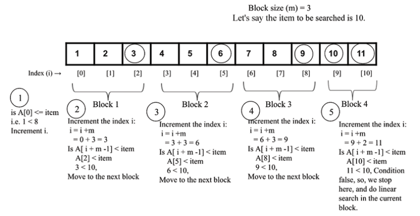

# Searching

A search algorithm is a method for finding an item or group of items with specific properties within a collection of items. The items in the collection can be thought of as being stored in an array or list, and the process of searching for an item can be thought of as comparing the item with each item in the collection until a match is found.

The set of items can be already sorted or unsorted.

## Linear Search

Linear search is the simplest search algorithm. It is a brute-force search algorithm that compares each element in the list with the target element until a match is found. If the target element is found, the algorithm returns the index of the element in the list. If the target element is not found, the algorithm returns `None`.

### Unordered linear search

We match the target element with each element in the list until a match is found.

```python
def search(unordered_list, search_term):
  for i, item in enumerate(unordered_list):
    if search_term = item
      return i
  return None
```

The time complexity of this algorithm is `O(n)`, where n is the number of elements in the list.

### Ordered linear search

If the list is ordered, we can stop the search as soon as we find an element that is greater than the target element.

```python
def search(ordered_list, search_term):
  for i, item in enumarate(ordered_list):
    if search_term == item:
      return i
    if search_term < item:
      return None
  return None
```

Time complexity of this algorithm is `O(n)`.

## Jump Search

Jump search is an algorithm that searches for an element in a sorted list by jumping ahead by a fixed number of steps. The algorithm works by dividing the list into blocks of equal size and then jumping ahead by a fixed number of steps until the target element is found or the end of the list is reached.

Steps:

1. Set the block size to √n.
2. Jump ahead by the block size until the target element is found or the end of the list is reached.

The next steps depend on the sorting used over the array

3. If the search value is less than the last element of the block, we perform a linear search within the block.
4. If the search value is greater than the last element of the block, we jump ahead by another block size.
5. If the search term is found, return the index of the element in the list. If the search term is not found, return `None`.



```python
import math

def jump_search(ordered_list, item):
    list_size = len(ordered_list) # n
    block_size = int(math.sqrt(list_size)) # m
    i = 0

    while i != len(ordered_list)-1 and ordered_list[i] <= item:
        print("Block under consideration - {}".format(ordered_list[i: i+block_size]))

        if i + block_size > len(ordered_list):
            block_size =  len(ordered_list) - i
            block_list = ordered_list[i: i + block_size]

            j = search_ordered(block_list, item)

            if j == -1:
                print("Element not found")
                return

            return i + j

        if ordered_list[i + block_size -1] == item:
            return i + block_size - 1
        elif ordered_list[i + block_size - 1] > item:
            block_array = ordered_list[i: i + block_size - 1]
            j = search_ordered(block_array, item)
            if j == -1:
                print("Element not found")
                return
            return i + j
        i += block_size
```

The worst-case time complexity of this algorithm is `n/m` where `n` is the number of elements in the list and `m` is the block size.
If the block size is set to `√n`, the time complexity of the algorithm is `O(√n)`.

## Binary Search

Binary search is an algorithm that searches for an element in a sorted list by repeatedly dividing the list in half. The algorithm works by comparing the target element with the middle element of the list. If the target element is equal to the middle element, the algorithm returns the index of the middle element. If the target element is less than the middle element, the algorithm searches the left half of the list. If the target element is greater than the middle element, the algorithm searches the right half of the list. The algorithm continues to divide the list in half until the target element is found or the end of the list is reached.

The time complexity of binary search is `O(log n)`.

```python
def binary_search_iterative(ordered_list, search_term):
  list_size = len(ordered_list)
  index_start = 0
  index_end = list_size - 1

  while index_start <= index_end:
    index_middle = (index_start + index_end) / 2

    if ordered_list[index_middle] === search_term:
      return index_middle
    if search_term > ordered_list[index_middle]:
      index_start = index_middle + 1
    else:
      index_end = index_middle - 1

  if index_start > index_end:
    return None

```

```python
def binary_search_recursive(ordered_list, first_element_index, last_element_index, term):
    if (last_element_index < first_element_index):
        return None
    else:
        mid_point = first_element_index + ((last_element_index - first_element_index) // 2)
        if ordered_list[mid_point] > term:
            return binary_search_recursive (ordered_list, first_element_index, mid_point-1, term)
        elif ordered_list[mid_point] < term:
            return binary_search_recursive (ordered_list, mid_point+1, last_element_index, term)
        else:
            return mid_point
```

## Exponential Search

The exponential search is used when we have large arrays and we don't know the size of the array. The algorithm works by finding the range in which the target element is located and then performing a binary search within that range.

We implement jumps of size 2^i until we find a value greater than the target element. Then we perform a binary search within the range of the last jump.

```python
def exponential_search(ordered_list, search_value):
  if (ordered_list[0] == search_value):
    return 0
  index = 1

  while index < len(order_list) and ordered_list[index] <= search_value:
    index = index * 2

  return binary_search_recursive(ordered_list, index/2, min(index, len(ordered_list)), search_value)

```
