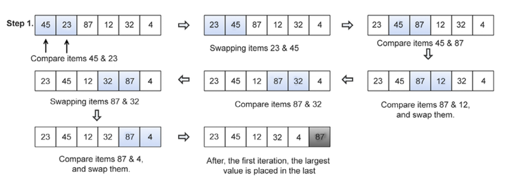
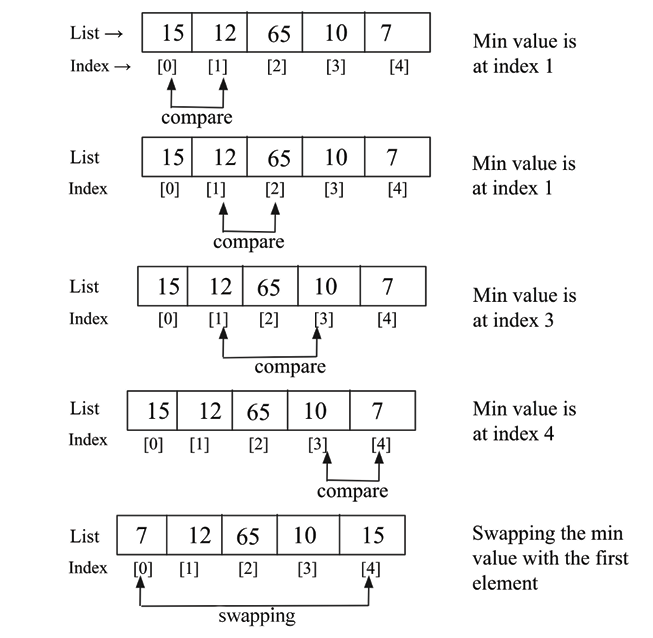
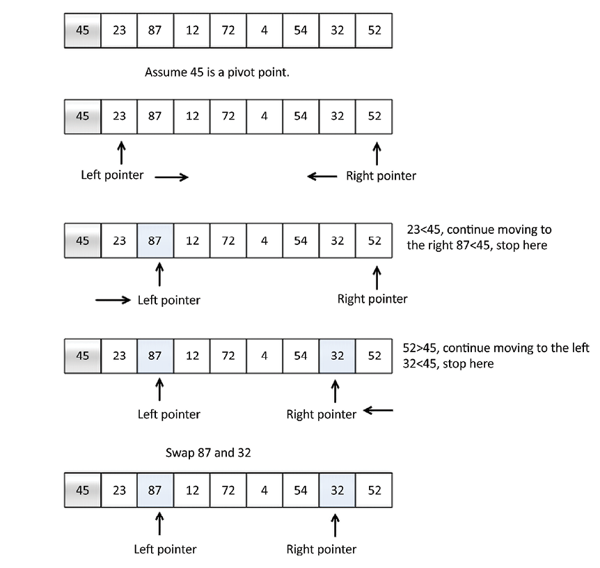
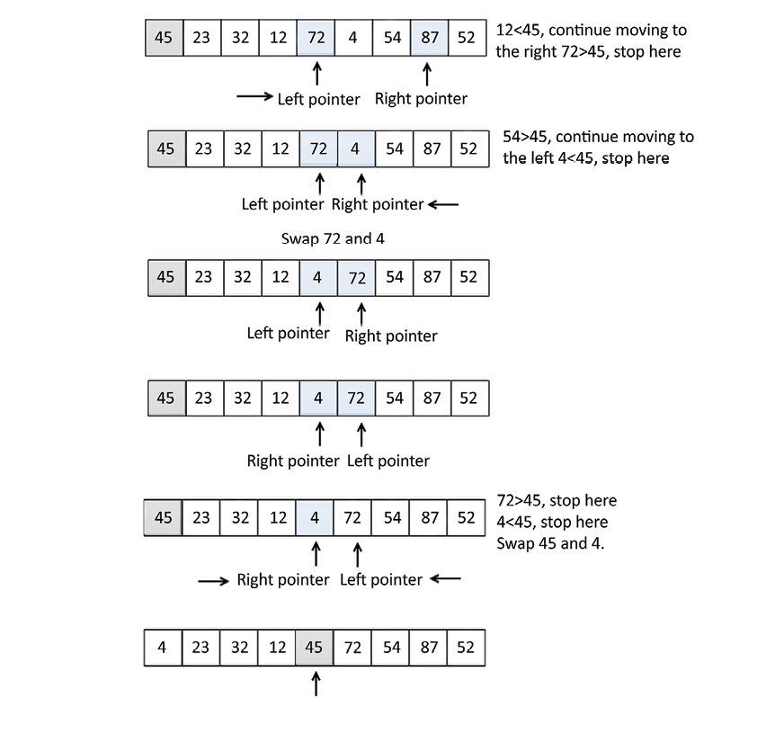
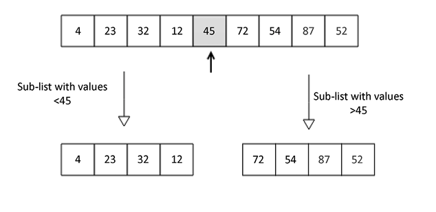

# Sorting

Sorting is a common task in programming. It is the process of arranging items in a list in a specific order. Sorting can be done in ascending or descending order. There are many sorting algorithms available, each with its own advantages and disadvantages. Some of the most common sorting algorithms are:

## Bubble Sort Algorithm

Bubble sort is a simple sorting algorithm that repeatedly steps through the list, compares adjacent elements, and swaps them if they are in the wrong order. The pass through the
list is repeated until no swaps are needed, which indicates that the list is sorted.
The proecess is repeated `n-1` times for a list of `n` elements.

```python
def swap_elements(arr, first_index, second_index):
    temp = arr[first_index]
    arr[first_index] = arr[second_index]
    arr[second_index] = temp
```



After the first pass, the largest element will be at the end of the list. After the second pass, the second largest element will be at the second last position, and so on. The process is repeated until the list is sorted.

```python
def bubble_sort(unordered_list):
    iteration_number = len(unordered_list) - 1

    for i in range(iteration_number, 0, -1): # 10, 9, 8, 7, 6, 5, 4, 3, 2, 1
        for j in range(i): # 0, 1, 2, 3, 4, 5, 6, 7, 8, 9 | 0, 1, 2, 3, 4, 5, 6, 7, 8 | 0, 1, 2, 3, 4, 5, 6, 7 | 0, 1, 2, 3, 4, 5, 6 | 0, 1, 2, 3, 4, 5 | 0, 1, 2, 3, 4 | 0, 1, 2, 3 | 0, 1, 2 | 0, 1
            if unordered_list[j] > unordered_list[j+1]:
                temp = unordered_list[j]
                unordered_list[j] = unordered_list[j+1]
                unordered_list[j+1] = temp
```

Time complexity of bubble sort is `O(n^2)`. Bubble sort is not recommended for large lists.

## Insertion Sort Algorithm

We maintain two sublists, one that is already sorted and another that is unsorted. We take elements from the unsorted sublist and insert them into the sorted sublist in the correct position. The process is repeated until the unsorted sublist is empty.

```python
def insertion_sort(unsorted_list):
  list_length = len(unsorted_list)

    for index in range(1, list_length):
        search_index = index
        insert_value = unsorted_list[index]

        while search_index > 0 and unsorted_list[search_index-1] > insert_value :
            unsorted_list[search_index] = unsorted_list[search_index-1]
            search_index -= 1
        unsorted_list[search_index] = insert_value
```

## Selection Sort Algorithm

Selection sort is an in-place comparison sorting algorithm. It divides the input list into two parts: the sublist of items already sorted and the sublist of items remaining to be sorted. The algorithm selects the smallest element from the unsorted sublist and swaps it with the leftmost unsorted element. The process is repeated until the unsorted sublist is empty.



```python
def selection_sort(unsorted_list):
  size_of_list = len(unsorted_list)

  for i in range(size_of_list):
    small = i

    for j in range(i+1, size_of_list):

      if unsorted_list[j] < unsorted_list[small]:
        small = j
        temp = unsorted_list[i]
        unsorted_list[i] = unsorted_list[small]
        unsorted_list[small] = temp
```

Time complexity of selection sort is `O(n^2)`. Selection sort is not recommended for large lists.

## Quick Sort Algorithm

Quick sort is a divide-and-conquer algorithm. It works by selecting a 'pivot' element from the array and partitioning the other elements into two sub-arrays according to whether they are less than or greater than the pivot. The sub-arrays are then sorted recursively.





After the first pass, the pivot element will be in its correct position. The process is repeated for the sub-arrays until the entire list is sorted.
